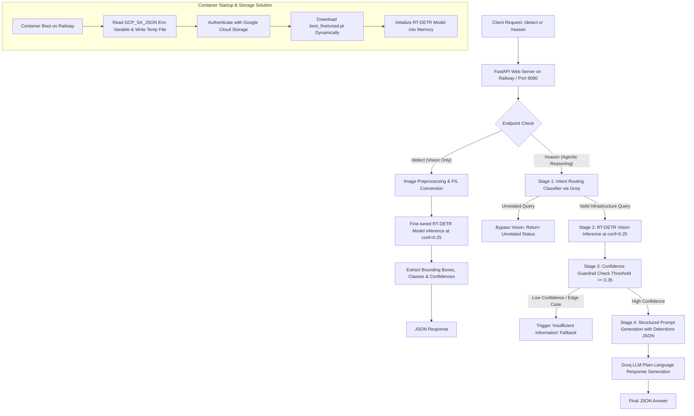

# Civic Infrastructure AI API: Constrained Object Detection & Reasoning System

[](#)
[](#)
[](#)
[](#)

An end-to-end Computer Vision and Applied Machine Learning API built for automated road damage detection and natural-language reasoning.

---

## 🏗 System Architecture & Deployment Solution

### 1. Architectural Diagram

The application handles requests through a dual-pipeline routing architecture designed for both direct vision inference and agentic natural-language reasoning.



### 2. The Deployment & Storage Solution

Deploying heavy machine learning models (`.pt` files) directly inside container images often triggers Git LFS pointer corruptions, build timeouts, or severe cloud hosting memory crashes.

**The Solution**

We decoupled the model weights from the GitHub source repository.

At container startup on Railway, the application automatically:

1. Reads secure service account credentials (`GCP_SA_JSON`).
2. Authenticates with Google Cloud Storage (GCS).
3. Streams the real binary checkpoint (`best_finetuned.pt`).
4. Initializes the RT-DETR instance safely within container limits.

---

## 🚀 Key Features & Engineering Highlights

### Custom Non-COCO Domain

Trained on specialized road damage classes:

- Potholes
- Structural cracks
- Surface wear

Rather than standard COCO objects, ensuring domain-specific utility.

### Dynamic GCS Weight Loading

Prevents Git LFS pointer errors and memory bloat during container startup by fetching weights dynamically from Google Cloud Storage.

### Zero-Framework Reasoning Layer

Built natively using the standard `requests` library for Groq API integration—strictly avoiding bloated agent frameworks such as:

- LangChain
- LangGraph

This was done as mandated by system constraints.

### Safety Guardrails

The system uses **two distinct thresholds**, each serving a different purpose in the pipeline:

- **Inference Threshold (`0.25`)** — The sensitivity threshold passed directly to RT-DETR (`conf=0.25`) during model inference. This is kept low so the model catches initial candidate boxes without filtering them out too early.
- **Confidence Guardrail (`0.35`)** — A stricter post-processing safety threshold applied after detection. If the highest detection confidence falls below `0.35`, the system triggers the `low_confidence` fallback rather than letting the LLM reason over weak or ambiguous predictions.

```
confidence < 0.35
```

This forces safe fallbacks:

```
"Insufficient information"
```

rather than hallucinating answers from weak visual detections.

### Audit Logging & Error Resilience

Comprehensive stream and file logging using:

```
app_audit.log
```

The logging tracks:

- Latencies
- Exception traces
- Endpoint hits

---

## 📂 Repository Structure

To ensure full reproducibility according to screening specifications, the repository is structured as follows:

```
road-damage-detection-api/
│
├── training/
│   ├── training file.ipynb
│   │   # Kaggle training notebook with configured hyperparameters
│   │
│   └── evaluate.ipynb
│       # Evaluation script computing mAP, precision/recall metrics
│
├── main.py
│   # FastAPI application (Endpoints, GCS loader, Groq integration)
│
├── Dockerfile
│   # Container definition optimized for Cloud Run / Railway
│
├── requirements.txt
│   # Pinned Python dependencies
│
├── app_audit.log
│   # Runtime audit and latency logger
│
└── README.md
    # Complete system documentation
```

---

## 🛠 Reproducibility & Training Specifications

### 1. Environment & Hardware

**Hardware Used**

```
Kaggle Notebook GPU Environment (Training)
                ↓
CPU Container Environment (Inference)
```

**Framework**

```
torch>=2.0.0
ultralytics>=8.0.0
fastapi
google-cloud-storage
```

**Training Time**

Approximately:

```
~2.5 hours across 50 epochs
```

### 2. Hyperparameters

`training file.ipynb`

```python
results = model.train(
    data="/kaggle/working/data.yaml",
    epochs=50,
    imgsz=640,
    batch=8,
    project="/kaggle/working/road_damage_project",
    name="rtdetr_run1",
    seed=42,
    deterministic=False,
    device=0
)
```

---

## 🔌 API Endpoints & Usage Instructions

### Base URL

**Live Railway Deployment**

`https://road-damage-detection-api-production.up.railway.app`

### Endpoint 1: Vision Only

`POST /detect`

Accepts an image file, runs RT-DETR inference, and returns:

- Raw bounding boxes
- Class names
- Confidence scores

**cURL Example**

```bash
curl -X 'POST' \
  'https://road-damage-detection-api-production.up.railway.app/detect' \
  -H 'accept: application/json' \
  -H 'Content-Type: multipart/form-data' \
  -form 'file=@road_damage_sample.jpg'
```

**Sample Response Payload**

```json
{
  "status": "success",
  "total_detections": 2,
  "detections": [
    {
      "class_name": "pothole",
      "confidence": 0.8912,
      "bbox": [120.5, 340.2, 210.8, 415.6]
    },
    {
      "class_name": "crack",
      "confidence": 0.7643,
      "bbox": [45.0, 100.1, 180.4, 220.0]
    }
  ]
}
```

### Endpoint 2: Natural Language Reasoning

`POST /reason`

Accepts:

1. An image
2. A natural language question

The endpoint:

1. Evaluates the user's intent.
2. Performs vision inference.
3. Runs confidence guardrails.
4. Outputs a structured plain-language explanation.

**cURL Example**

```bash
curl -X 'POST' \
  'https://road-damage-detection-api-production.up.railway.app/reason' \
  -H 'accept: application/json' \
  -H 'Content-Type: multipart/form-data' \
  -form 'file=@road_damage_sample.jpg' \
  -form 'question="How severe is the road damage shown in this picture?"'
```

**Sample Response Payload — Success**

```json
{
  "status": "success",
  "response": "Based on the visual analysis, the system detected 1 pothole with high confidence."
}
```

**Sample Response Payload — Guardrail Triggered / Low Confidence**

```json
{
  "status": "low_confidence",
  "response": "The detection results are insufficient to answer confidently. Human verification is recommended."
}
```

---

## 🏃 Local Setup & Execution

### Clone the Repository

```bash
git clone https://github.com/Eshwar-129/road-damage-detection-api.git
cd road-damage-detection-api
```

### Install Dependencies

```bash
pip install -r requirements.txt
```

### Configure Environment Variables

Create a `.env` file in the root directory:

```
GROQ_API_KEY=your_groq_api_key_here
GCP_SA_JSON={"type": "service_account", ...}
```

Where:

- `GROQ_API_KEY` is the API key used for Groq integration.
- `GCP_SA_JSON` contains the Google Cloud Service Account credentials.

### Run the Application Locally

```bash
uvicorn main:app --host 0.0.0.0 --port 8080 --reload
```

---

## 🔄 Overall System Flow

```
Client
  |
  v
FastAPI / Railway
  |
  +--------+--------+
  |                 |
  v                 v
/detect          /reason
  |                 |
  v                 v
Image Preprocessing   Intent Classification
  |                 |
  v            +------+------+
RT-DETR Model  |             |
  |            v             v
  |        Unrelated     Valid Query
  |            |             |
  |            v             v
  |      Return Status    RT-DETR
  |                          |
  |                          v
  |                    Confidence Check
  |                       /       \
  |                      /         \
  |                     v           v
  |             Low Confidence   High Confidence
  |                     |             |
  |                     v             v
  |              Insufficient    Structured Prompt
  |               Information         |
  |                     |             v
  |                     |          Groq LLM
  |                     |             |
  +---------------------+-------------+
                         |
                         v
                   JSON Response
```

---

## ☁️ Model Storage & Container Startup Flow

```
Railway Container Starts
        |
        v
Read GCP_SA_JSON
        |
        v
Authenticate with GCS
        |
        v
Download best_finetuned.pt
        |
        v
Load RT-DETR Model
        |
        v
Model Ready for Inference
```

---

## 🛡 Confidence Guardrail Logic

The reasoning endpoint uses a confidence threshold of:

```
0.35
```

The basic decision flow is:

```
Detection Confidence
        |
        v
   Is confidence
     >= 0.35?
     /      \
   No        Yes
    |          |
    v          v
Low Confidence  Continue
    |          |
    v          v
"Insufficient   Generate
Information"   Structured Prompt
                |
                v
             Groq LLM
                |
                v
           Final Response
```

---

## 🎯 Key Engineering Decisions

| Area | Implementation |
|---|---|
| Computer Vision | Fine-tuned RT-DETR |
| API Framework | FastAPI |
| Deployment | Railway |
| Model Storage | Google Cloud Storage |
| LLM | Groq |
| Reasoning Integration | Standard `requests` library |
| Agent Framework | None |
| Training Environment | Kaggle GPU |
| Inference Environment | CPU Container |
| Logging | `app_audit.log` |
| Inference Threshold | 0.25 |
| Confidence Guardrail | 0.35 |
| Model Checkpoint | `best_finetuned.pt` |
| Image Size | 640 |
| Batch Size | 8 |
| Epochs | 50 |
| Random Seed | 42 |

---

## 📌 Summary

This project provides an end-to-end AI-powered civic infrastructure system that combines:

- RT-DETR object detection
- Road damage classification
- Natural-language reasoning
- Groq LLM integration
- Confidence-based safety guardrails
- Google Cloud Storage model loading
- FastAPI REST endpoints
- Railway cloud deployment
- Audit logging
- Containerized inference

The architecture separates the heavy model weights from the application source code and dynamically loads the model from Google Cloud Storage when the Railway container starts.

The `/detect` endpoint provides direct computer vision predictions, while the `/reason` endpoint adds intent classification, vision inference, confidence validation, structured prompt generation, and natural-language reasoning.

---

## 📦 Technology Stack

- Python
- FastAPI
- PyTorch
- Ultralytics
- RT-DETR
- Groq API
- Google Cloud Storage
- Railway
- Docker
- Kaggle GPU Environment

---

## ✅ Project Characteristics

- End-to-end Computer Vision API
- Domain-specific road damage detection
- Fine-tuned RT-DETR model
- Natural-language reasoning
- Intent routing
- Confidence-based guardrails
- Dynamic model loading from GCS
- Containerized deployment
- Railway deployment
- API-based architecture
- Audit logging
- Reproducible training configuration
- No LangChain or LangGraph dependency

---

## 🔗 Repository

```
https://github.com/Eshwar-129/road-damage-detection-api.git
```
